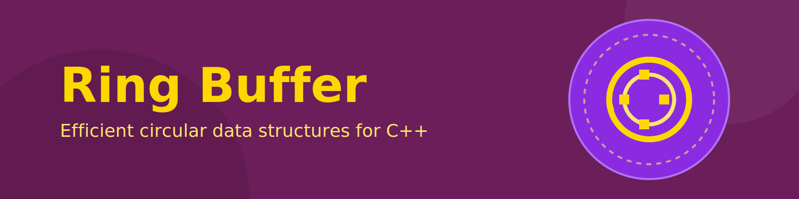

# Ring Buffer Implementation

`ring_buffer` is a header-only, template-based circular buffer that provides the predictable performance and fixed-capacity behavior needed by real-time, embedded, and high-throughput systems. The project also ships a thread-safe wrapper, unit tests, benchmarks, and a multithreaded producer/consumer example so you can see how the buffer behaves under contention.

## Table of Contents
- [Key Features](#key-features)
- [Getting Started](#getting-started)
- [Building and Testing](#building-and-testing)
- [Running Benchmarks](#running-benchmarks)
- [Examples](#examples)
- [License](#license)

## Key Features
- **Header-only, template-based API** located in `include/ring_buffer.h` for zero-overhead integration.
- **Thread-safe wrapper** `include/thread_safe_ring_buffer.h` that uses mutexes and condition variables for blocking/non-blocking producer-consumer scenarios.
- **STL-friendly iterators** plus safe move/copy semantics so the buffer works with modern C++ idioms.
- **Extensive unit coverage** via `test/ring_buffer_tests.cc` and `test/thread_safe_ring_buffer_tests.cc`.
- **Performance benchmarking** and a producer/consumer example to validate throughput and latency expectations.

## Getting Started
### Prerequisites
- C++ compiler with C++23 support (gcc/clang/msvc)
- CMake 3.26 or later
- GoogleTest (handled automatically via the `test` subproject)

### First build
```bash
mkdir -p build && cd build
cmake -DCMAKE_BUILD_TYPE=Release ..
cmake --build .
```
This configures the project into `build/`, compiles the library, the unit tests, benchmarks, and the example binaries.

## Building and Testing
- Run the full test suite (both the core and thread-safe ring buffer tests are linked into `run_tests`):
```bash
cmake --build build --target run_tests
ctest --output-on-failure -C Release
```
- You can inspect the generated executables under `build/test/` after the build completes.

## Running Benchmarks
The dedicated benchmark target exercises push/pop, iterator traversal, and emplace workloads on different buffer sizes.
```bash
cmake --build build --target benchmark_ring_buffer
./build/benchmarks/benchmark_ring_buffer
```
Feel free to adjust compiler flags, buffer capacities, or iteration counts inside `benchmarks/benchmark_ring_buffer.cc` before rebuilding the target.

## Examples
- **Producer/Consumer Simulation**: `examples/producer_consumer_example.cc` demonstrates four producers and two consumers racing through a `ring_buffer_thread_safe<DataPacket>` with timeout-aware push/pop. Build and run it with:
```bash
cmake --build build --target producer_consumer_example
./build/examples/producer_consumer_example
```
- **Embedded static allocator**: `examples/embedded_static_allocator_example.cc` shows how to wrap `ring_buffer` with a tiny allocator that points at pre-allocated storage so no heap calls are performed during runtime. Build and run it the same way:
```bash
cmake --build build --target embedded_static_allocator_example
./build/examples/embedded_static_allocator_example
```
- **Thread-safe API Usage**: Look inside `include/thread_safe_ring_buffer.h` for blocking, try/push, and timeout helpers. The tests exercise the same API so you can copy the patterns.

## License
Released under the GNU General Public License v3.0. See `LICENSE` for the full text.
